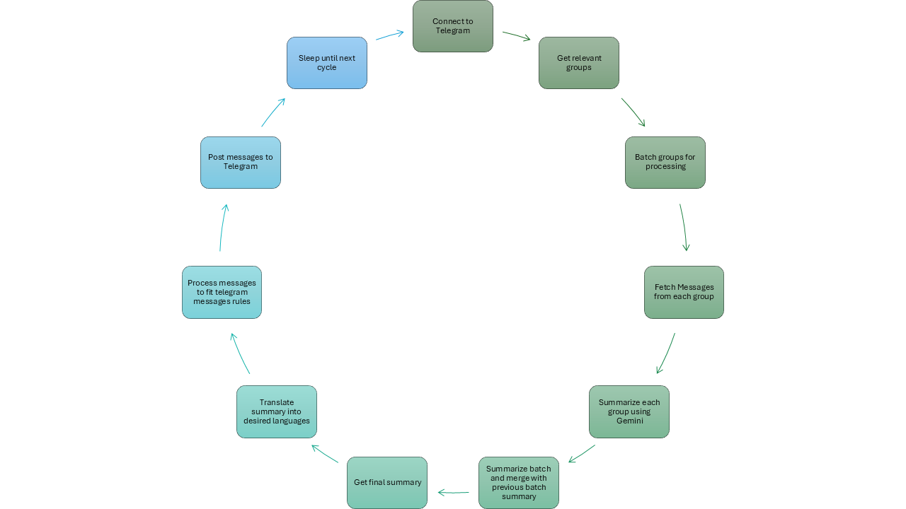

# Overview

**NewsGPT** is an automation pipeline designed to simplify the process of collecting, summarizing, and distributing news updates from Telegram groups. It uses the **Telethon** library for interacting with the Telegram API and integrates **Google Generative AI** for summarization and translation, enabling efficient, multilingual news distribution with minimal manual effort.

## Pipeline

